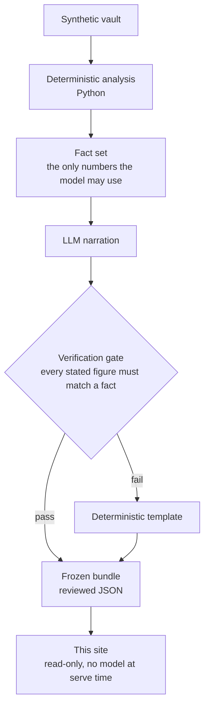

# Fitness Analyst demo

A click-through demo of an AI running coach in which **every number is computed
by deterministic Python** from the user's health data, and **the language model
only narrates those numbers**. The site looks and behaves like the phone app it
demonstrates: pick one of four synthetic people and one of their goals, go
through the onboarding that produced the plan, then use the app's four tabs
(Today, Week, Chat, Reports) as that person. Inside every answer the figures
Python computed wear their own colour, the model's sentences are serif, and a
Sources row reveals the facts the answer was built from.

This repository is honest about what it is: **a static-content API, not a live
AI service.** Nothing here calls a model. Every answer, plan and interview was
generated offline in advance, reviewed, and frozen into a JSON bundle; this
site is a small read-only FastAPI app that serves the bundle plus a vanilla
JS/SVG frontend (no framework, no build step, no CDN).

The deterministic engine is open source:
[rkutyna/fitness-analyst-ai](https://github.com/rkutyna/fitness-analyst-ai).

## Architecture



Everything left of "Frozen bundle" happens offline, in a private generator that
makes real model calls. Everything from the bundle onward is this repo.

## Run it locally

```bash
docker compose up -d        # http://localhost:8080
```

or, for development with the Python venv:

```bash
python3.11 -m venv .venv && ./.venv/bin/pip install -r requirements-dev.txt
make dev                    # http://localhost:8000, web/ re-read on every request
make test                   # pytest
make image                  # docker build
make run                    # build and run the image on :8080
make smoke                  # build, run, fetch every route in /api/tree, stop
```

`BUNDLE_DIR` (default `/app/bundle`) points at the bundle directory. The app
validates every file with `app/bundle_schema.py` at startup and refuses to
start if any is missing or invalid.

## Deploy

The repository publishes its image to GitHub Container Registry on every push
to `main`, and `infra/main.bicep` plus `.github/workflows/deploy.yml` deploy it
to Azure Container Apps (consumption plan, scaled to zero). The owner's
step-by-step runbook, including the custom domain, cost notes, rollback and
teardown, is in [docs/DEPLOY.md](docs/DEPLOY.md).

## The API

All routes are `GET`; there are no write routes, no auth and no cookies.

| Route | Content |
|---|---|
| `/api/manifest`, `/api/tree` | what generated the bundle; people and goals |
| `/api/people/{pid}/overview`, `/api/people/{pid}/qa` | weekly series with Python-written summaries; person questions |
| `/api/goals/{gid}/interview`, `/plan`, `/qa` | onboarding transcript with deterministic cards; first plan; goal questions |
| `/api/goals/{gid}/today` | optional, validated by the strict `Today` model at startup: the Today screen's sections for each day of the first week; 404 when the bundle has no `goals/<id>/today.json`, and an invalid file stops startup |
| `/api/goals/{gid}/briefs` | optional, validated by the strict `Briefs` model at startup: the app's morning brief (and evening review) for the pinned day, each with its full text, the closing narration on its own, the facts Python published and the verification; 404 when the bundle has no `goals/<id>/briefs.json`, and an invalid file stops startup |
| `/healthz`, `/readyz` | liveness; bundle loaded |

Unknown ids return 404. Responses carry an ETag and
`Cache-Control: public, max-age=300`, are gzipped, and come with a strict CSP
(no inline script or style), `X-Content-Type-Options`, `Referrer-Policy` and
`frame-ancestors 'none'`.

## The frontend

`web/` is plain ES modules and one stylesheet: no framework, no build step, no
external request. Every screen is a hash route, so each is linkable and
back/forward work:

| Route | Screen |
|---|---|
| `#/` | the pitch and the four people |
| `#/p/{pid}` | a person and their three goals |
| `#/p/{pid}/g/{gid}` | enters the goal: onboarding first, the app once it has been seen |
| `#/p/{pid}/g/{gid}/welcome` | first run: the interview, the computed cards, the week to accept |
| `#/p/{pid}/g/{gid}/today` | Today |
| `#/p/{pid}/g/{gid}/week`, `/week/{date}` | Week, and one day opened from it |
| `#/p/{pid}/g/{gid}/chat`, `/chat?q={n}` | Chat, optionally with question `n` already asked |
| `#/p/{pid}/g/{gid}/reports`, `/reports/briefs/{date}` | Reports, and one day's briefs opened from it |
| `#/about` | how the demo was made |

On Today the pinned day's brief narration sits under the Yesterday card; the Reports tab opens each day's full briefs. The frontend computes nothing. It prints the display strings the bundle
carries, marks a figure inside an answer only where that string appears
verbatim, and builds the page from text nodes, never from HTML strings. At
900px and wider the app sits in a phone-width frame with a panel beside it
that explains the screen in view; narrower, the app fills the viewport and the
same panel opens from the info button.

## How the bundle is produced

`bundle/` is the public export of a bundle generated offline by a private
generator. The generator runs the real engine code paths against four synthetic
people (real model calls, on the day it is run), gates every answer, and a
separate export step strips everything internal (module names, clock pins,
tool names, raw traces), gives each source a plain-language name, decides in
Python which answers are about the plan and each chart's headline number, and
re-runs the numbers, dates and denylist checks on what it wrote.
`app/bundle_schema.py` is copied verbatim from the generator's public schema and
is the single source of truth for the format. The site itself calls no model.
The `bundle/` checked in here may be a dry run with stub models; the notice at
the top of every screen says so when the manifest's `dry_run` is true.
